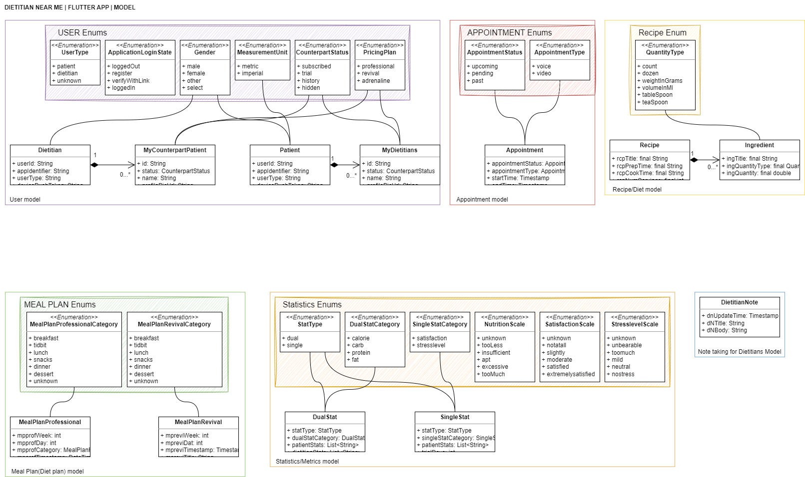
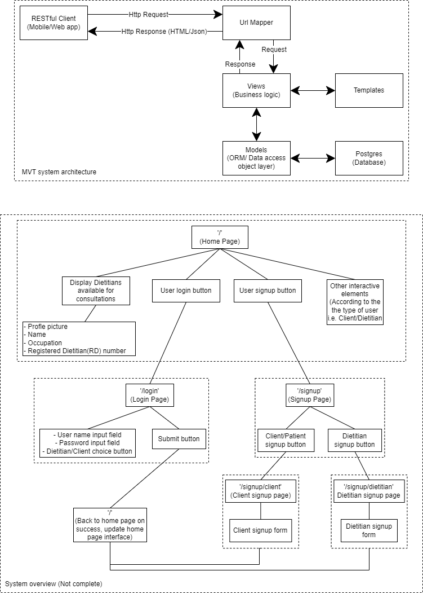

## Project setup instructions
1. Create a virtual environment for the project
2. Activate virtual environment
3. Run `pip install -r requirements.txt`
4. Create a `.env` file inside `dnm_backend_django` directory
5. Put following contents in your `.env` file (update fields according to your psql configuration)  
  DATABASE_NAME=existing_psql_database_name  
  DATABASE_USER=your_psql_username  
  DATABASE_PASS=your_psql_password  

## Flutter app models class diagram

## System overview diagram
